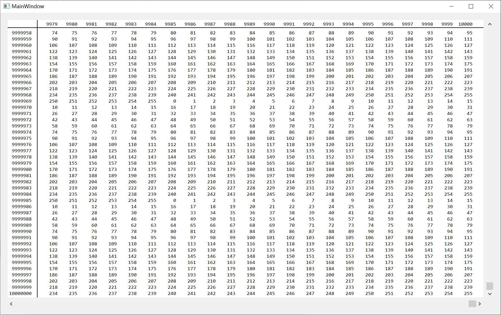

# NumericTable


## Introduction

Qt table view used to display huge amount of numeric values


## Details

- Display huge amount(10,000 x 10,000,000 at least) numeric data
- Use QAbstractItemModel
- Qt Designer plugin support
- Only ASCII characters supported in data fields
- UTF-8 text supported in headers
- Optimized for large count of rows, not columns


## Build

For source-only, add codes below into **.pro** file:

``` Qt
include(src/NumericTable.pri)
```

For dynamic-link or Qt Designer plugin, compile **designer/designer.pro**, library files will be found in **lib**.


## Snapshot

